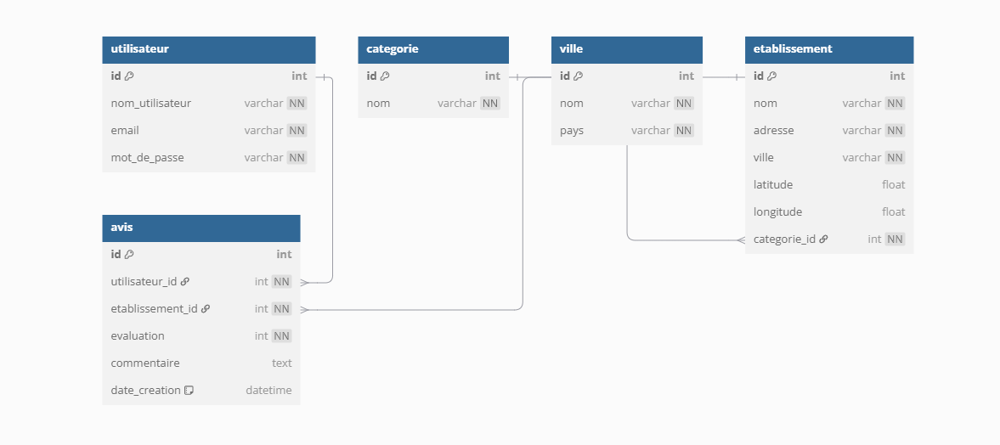

# 📜 Cahier des Charges du Projet OSM

## 📑 Table des matières

1. [📖 Introduction](#1-introduction)  
2. [🎯 Objectifs](#2-objectifs)  
3. [✨ Fonctionnalités principales](#3-fonctionnalités-principales)  
4. [🛠️ Architecture technique](#4-architecture-technique)  
5. [🎨 Interface utilisateur](#5-interface-utilisateur)  
6. [⚡ Performances](#6-performances)  
7. [💻 Langages utilisés](#7-langages-utilisés)  
8. [⚠️ Mise en garde](#8-mise-en-garde)

---

---

## 1. 📖 Introduction

> **:memo: NOTE**  
> Le projet OSM a pour objectif de développer une application permettant de répertorier les établissements (restaurants, garages, etc.) d’une ville via l’API OpenStreetMap. Les utilisateurs pourront rechercher une ville, afficher une carte interactive, consulter des informations sur les établissements et laisser des avis.

---

## 2. 🎯 Objectifs

- ✅ Permettre aux utilisateurs de rechercher des établissements dans une ville via l'API OpenStreetMap.  
- ✅ Offrir une carte interactive des établissements avec des informations détaillées.  
- ✅ Permettre aux utilisateurs non connectés de consulter les établissements.  
- ✅ Offrir aux utilisateurs connectés la possibilité de laisser des avis et des notes.  
- ✅ Proposer un design intuitif et une expérience utilisateur fluide.

---

## 3. ✨ Fonctionnalités principales

### 3.1 🏠 Page d’Accueil

- **Présentation générale du projet**  
  - 📝 Affichage d'une brève description de l'application.  
  - 🌟 Introduction aux fonctionnalités principales.

- **Menu de navigation**  
  - 🗺️ Accès rapide à la carte interactive.  
  - 🔗 Liens vers la page d’inscription et de connexion.

- **Recherche de ville**  
  - 🔍 Barre de recherche permettant de saisir le nom d'une ville.  
  - 💡 Affichage de suggestions lors de la saisie.  
  - 📍 Une fois la ville sélectionnée, chargement de la carte avec les établissements associés.

### 3.2 🗺️ Carte interactive

- **Carte OpenStreetMap**  
  - 🌍 Intégration de l'API OpenStreetMap pour afficher la carte.  
  - 📌 Affichage des points d’intérêt (restaurants, garages, etc.) sous forme de marqueurs.  
  - 🔄 Possibilité de zoomer, dézoomer et déplacer la carte.

- **Informations sur les établissements**  
  - ℹ️ Lorsque l’utilisateur clique sur un marqueur, un infobulle s’affiche avec les informations de l’établissement : nom, adresse, avis, etc.

- **Filtres de recherche**  
  - 🗂️ Possibilité de filtrer les établissements par catégorie (restaurant, garage, etc.).  
  - ⭐ Filtre par note moyenne des établissements.

### 3.3 👤 Utilisateur non connecté

- **Navigation et consultation**  
  - 🌐 L’utilisateur peut naviguer sur la carte, consulter la liste des établissements et voir leurs informations sans se connecter.

- **Accès aux pages d’inscription et de connexion**  
  - 🔑 L’utilisateur peut se rediriger vers la page d’inscription/connexion s'il souhaite laisser un avis ou interagir avec le contenu.

### 3.4 🔒 Utilisateur connecté

- **Espace personnel**  
  - 🗃️ Possibilité de voir ses avis et évaluations passées.

- **Laisser un avis et évaluation**  
  - ⭐ Les utilisateurs peuvent attribuer une note (de 1 à 5 étoiles) et rédiger un avis pour chaque établissement visité.  
  - ✏️ Les avis peuvent être modifiés ou supprimés.

---

## 4. 🛠️ Architecture technique

- **Technologies utilisées**  
  - 🎨 Front-end : HTML, CSS, JavaScript (avec un framework comme React ou Vue.js)  
  - 🌍 API OpenStreetMap pour afficher les cartes et les établissements  
  - 🔐 Authentification : système d'authentification simple pour les utilisateurs (par exemple, via un formulaire avec email et mot de passe).

---

## 5. 🎨 Interface utilisateur

- **Responsive Design**  
  - 📱 L’application doit être adaptée aux appareils mobiles, tablettes et ordinateurs de bureau.

- **Éléments d’interface**  
  - 🖱️ Boutons clairs pour chaque action (connexion, inscription, recherche, filtrage des établissements, etc.).  
  - 🗺️ Utilisation de cartes interactives avec des marqueurs bien visibles.  
  - ⭐ Section d’avis et de notation facilement accessible et compréhensible.

---

## 6. ⚡ Performances

- **Temps de réponse**  
  - ⏱️ Le temps de chargement de la carte et des informations sur les établissements ne doit pas dépasser 3 secondes.  
  - 🗂️ Utilisation de techniques de mise en cache pour réduire les appels redondants à l'API.

- **Optimisation des requêtes API**  
  - 🔄 Les requêtes vers l'API OpenStreetMap doivent être optimisées pour limiter les appels et améliorer la performance globale.  
  - 📊 Implémentation de pagination ou de chargement différé pour les données volumineuses.

---

## 7. 💻 Langages utilisés

- 🖋️ HTML/CSS/JS  
- 🐍 Python Web  
- 🗄️ SQL

---

## 8. ⚠️ Mise en garde

> **:warning: WARNING**  
> Cette application est en cours de développement. Certaines fonctionnalités, comme l'authentification ou les filtres avancés, pourraient ne pas encore être totalement implémentées. Merci de votre patience pendant que nous l'améliorons.
